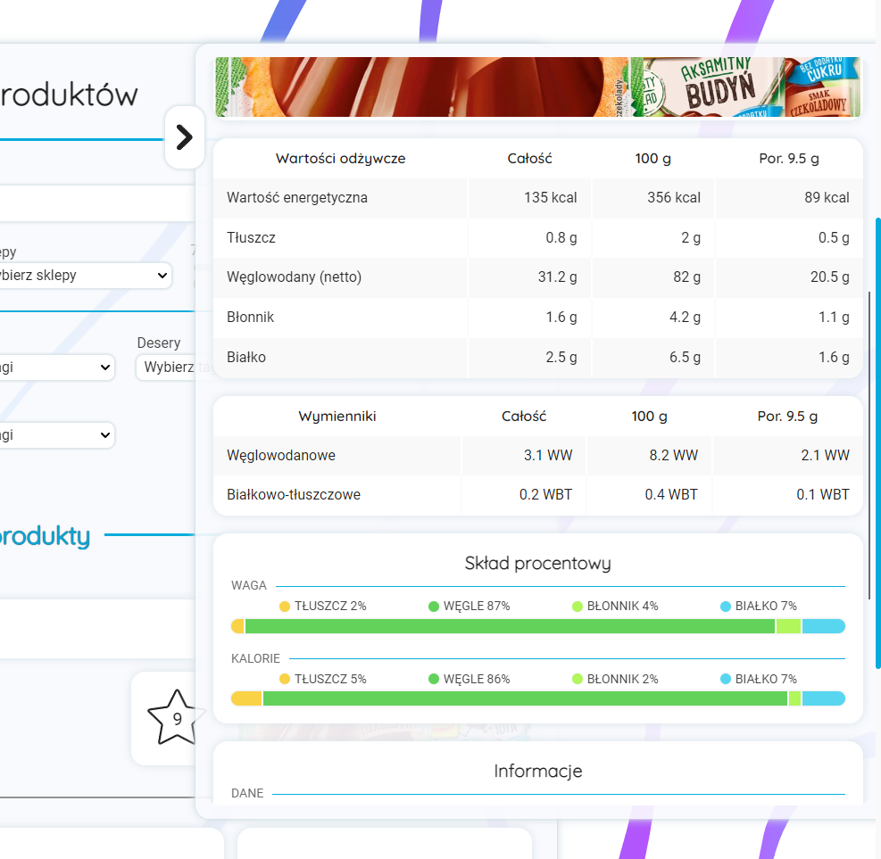
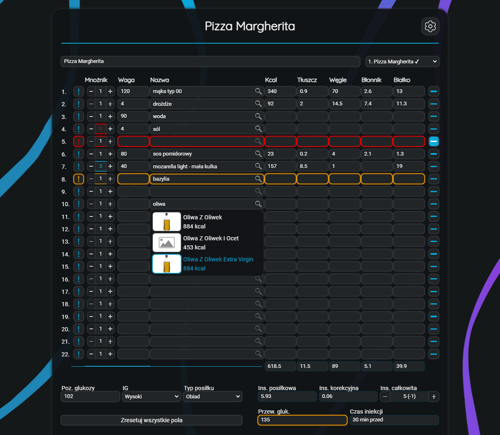

# Uverit-Cookbook

Uverit cookbook is a collection of recipes and products. The project also includes a calculator with some useful features, such as ingredient multiplier, insulin calculator and copying calculators.

## Recipes

### Add Recipes

The user can add, modify and search the recipe list.
The add-recipes page has a user-friendly UI that allows to upload data such as recipe name, description, image, type, ingredients, steps, nutritional and additional info.

Uploaded images are automatically resized and compressed. The user can upload an image by dragging or using upload button.
The embedded calculator feature is an easy and quick way to calculate recipe's nutritional info (calories, fat, carbs, fiber and protein).
The tag system allows for further recipe categorization.

### Modify Recipes

The modify-recipes page is a section for modifying or deleting existing recipes. The user can change every aspect of the recipe or delete it completely (inculding images stored on the server and recipe page).

### Recipe List

Recipe-list contains a list of every uploaded recipe. The user can sort results, choose a type or search by entering keywords. 
The dropdown lists allow for a quick way to choose the desired tags.

The results load sequentially when scrolling, which means that the page won't lag if there are too many recipes.

After searching, a basic info about the recipe is displayed (name, description, image, nutritional table, etc.). The user is redirected to the recipe page on click.

### Recipe Page

The recipe page contains all the info about the recipe. The data is presented in a modern, easy to understand UI.

The list of features: 
- basic recipe info (name, description, difficulty, upload date, date of last modification)
- image
- short, general info (recipe type, active time, total time, recipe multiplier)
- ingredient section (ingredient list with weight, that can also be multiplied for a larger/smaller quantity)
- ingredient loss /optional/ (such as oil loss during frying, etc.)
- ingredient calculator info /optional/ (if the user filled out the calculator section when adding the recipe)
- steps
- nutritional info table (data for the whole recipe, 100g and serving/weight entered by the user)
- nutritional percentage ratio (graph with nutritional info - calorie and weight ratio)
- detailed recipe info
    - type, difficulty
    - total and serving weight, number of servings
    - active, passive and total time
    - /optional/ expiration time
    - /optional/ additional info
- PDF button (save the recipe as a PDF file or print it)
- tags (search the tag on click)

## Products

### Add & Modify Products

The add-products and modify-products pages have the same features with some minor changes. 
The tag system is dependant on the product type, so every type has unique, fitting tags for a better experience and searchability.

### Product List

Similar to the recipe-list, but with some changes.
The tag lists are dependant on the product type.
The user can search by rating and/or shops (rating is optional, the user can use rating range slider).
There are no product pages. Instead, the products are displayed in a slide-in type modal, which allows for faster searching.

### Display Product

It's a major section in the product-list page. When user chooses a product, the info is displayed in a slide-in container.
Inculdes data such as:

- basic product info (brand, name, description, rating, type, upload date, date of last modification)
- image
- nutritional info table (data for the whole recipe, 100g and serving/weight entered by the user)
- nutritional percentage ratio (graph with nutritional info - calorie and weight ratio)
- detailed recipe info
    - total and serving weight, number of servings
    - /optional/ expiration time
    - /optional/ additional info
- shop list (search on click)
- tags (search the tag on click)

## Calculator

It's an advanced calculator for nutritional info of the ingredients. The page contains multiple independent calculators.

The user can enter the weight, ingredient name, calorie, fat, carbohydrate, fiber and protein values.
Every row can be multiplied (0x-10x).

The user can search for an item and get the macronutrients data from a REST API - the values are automatically inserted into the inputs.
The user can go to the settings and select which macronutrients should be used.
Search results can appear automatically as the user types, or only after clicking the search button.

It's possible to mark each row for attention (it will be highlighted).
It can be done either by clicking a button or by pressing "ctrl + q".

The user can remove the data in one row with a click of a button.
All of the data in every calculator can be removed by holding a button at the bottom.
The user can jump to the nearest cells from the one on focus by using ctrl + arrows (up, down, left, right).

The user can change/copy calculators to replace the other ones.
The data values are saved automatically to the localStorage.

### Insulin Calculator

A major section of the calculator page especially important for people with diabetes.
At the top of the page the user can enter the insulin amount needed for a specific meal type and the blood sugar amount that is decreased by 1 insulin unit.

Every calculator has its own insulin section at the bottom. By entering required data the user can get an accurate information about the total insulin units for the meal, meal insulin, correction insulin, expected blood sugar and recommended injection time before meal.

### Combining Nutritional Values

This part of the calculator allows combining the nutritional values from different calculators.
The user can choose one or more calculators using checkboxes.

The displayed data includes:
- total calorie count
- weight
    - combined weight for each nutritional value (fat, carbs, fiber, and protein)
    - graph with the weight ratio
- calorie percentage
    - combined calorie percentage for each nutritional value (as a part of all calories)
    - graph with the calorie ratio

## License

Uverit Cookbook - All Rights Reserved.